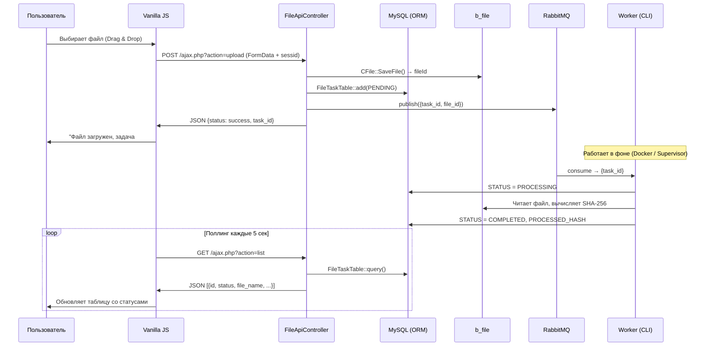

# Сервис асинхронной загрузки файлов (adm.asyncfiles)

Модуль для CMS 1С-Битрикс, реализующий веб-сервис для загрузки файлов и их асинхронной обработки с использованием очередей сообщений RabbitMQ.

## 🏗 Архитектура

```
┌─────────────────────────────────────────────────────────────────┐
│                        Пользователь                             │
│                    (Браузер / Vanilla JS)                        │
└────────────┬───────────────────────────────┬────────────────────┘
             │ POST /ajax.php?action=upload  │ GET ?action=list
             ▼                               ▼
┌─────────────────────────────────────────────────────────────────┐
│                      FileApiController                          │
│              (наследник BaseApiController)                       │
│                                                                 │
│  uploadAction():                    listAction():               │
│  1. CFile::SaveFile → b_file       1. FileTaskTable::query()   │
│  2. FileTaskTable::add()           2. JSON → браузер            │
│  3. RabbitMQService::publish()                                  │
└──────────┬──────────────────────────────────────────────────────┘
           │ AMQP publish
           ▼
┌──────────────────────┐     consume      ┌──────────────────────┐
│       RabbitMQ       │ ───────────────► │    bin/worker.php     │
│  file_processing_    │                  │                       │
│       queue          │                  │  FileProcessorService │
│  (durable, persist)  │                  │  → SHA-256 хеш        │
└──────────────────────┘                  │  → Обновление статуса │
                                          └──────────────────────┘
```

### Компоненты

| Компонент | Описание |
|-----------|----------|
| `lib/Controller/BaseApiController.php` | Базовый API-контроллер: CSRF, JSON-ответы |
| `lib/Controller/FileApiController.php` | Загрузка файлов и получение списка |
| `lib/Model/FileTaskTable.php` | ORM-таблица `adm_asyncfiles_task` |
| `lib/Service/RabbitMQService.php` | Публикация и подписка на очередь |
| `lib/Service/FileProcessorService.php` | Обработка файлов (SHA-256 хеш) |
| `lib/Enum/FileTaskStatus.php` | PHP 8.1 Enum статусов задач |
| `lib/Config/RabbitMQConfig.php` | Readonly DTO конфигурации RabbitMQ |
| `bin/worker.php` | CLI-воркер с graceful shutdown |
| `install/components/adm/asyncfiles.upload` | Компонент загрузки (drag-and-drop) |
| `install/components/adm/asyncfiles.list` | Компонент списка файлов (авто-поллинг) |

### Поток данных



## ⚙️ Требования к окружению

В случае установки модуля на существующий сервер (например, **BitrixVM**), а не через поставляемый Docker-контейнер, ваше окружение должно соответствовать следующим минимальным требованиям:

- **PHP**: >= 8.1
- **Bitrix Framework**: Установленное ядро D7
- **RabbitMQ**: Доступный сервер RabbitMQ (и установленные PHP-расширения `sockets`, `mbstring`)
- **Composer**: Для загрузки зависимостей модуля (библиотека `php-amqplib`)
- **Менеджер процессов (Supervisor / Systemd)**: Для поддержания работы фонового воркера (`bin/worker.php`) в режиме демона.

---

## 🚀 Установка

### Вариант 1: Docker-окружение (рекомендуется для проверки)

Полностью автономное окружение. Нужен только **Docker**.

#### Шаг 1. Клонирование и запуск

```bash
git clone <repo-url>
cd adm.asyncfiles
docker compose up -d --build
```

> Поднимается 5 контейнеров: nginx, php-fpm, mysql, rabbitmq, **worker** (автоматически).

#### Шаг 2. Установка Битрикс

Откройте в браузере:

```
http://localhost:8080/bitrixsetup.php
```

| Параметр | Значение |
|----------|----------|
| Редакция | **Стандарт** (пробная 30 дней) |
| Кодировка | **UTF-8** |
| Сервер БД | `mysql` |
| Пользователь БД | `bitrix` |
| Пароль БД | `bitrix` |
| Имя базы данных | `bitrix` |

#### Шаг 3. Установка модуля

Перейдите в:
```
http://localhost:8080/bitrix/admin/partner_modules.php
```

Найдите модуль **«Асинхронная загрузка файлов (adm.asyncfiles)»** → нажмите **«Установить»**.

При установке модуль автоматически:
- ✅ Создаёт таблицу `adm_asyncfiles_task`
- ✅ Копирует компоненты в `/local/components/adm/`
- ✅ Размещает публичную страницу `/asyncfiles.php`

#### Шаг 4. Тестирование

Откройте:
```
http://localhost:8080/asyncfiles.php
```

Загрузите файл через форму или перетащите Drag & Drop. Статус в таблице автоматически сменится:
`PENDING → PROCESSING → COMPLETED`

> **Воркер уже работает** — он запущен как Docker-сервис и обрабатывает очередь автоматически.

#### Дополнительные URL

| URL | Назначение |
|-----|------------|
| `http://localhost:8080/asyncfiles.php` | Страница загрузки и списка файлов |
| `http://localhost:8080/bitrix/admin/` | Админ-панель Битрикс |
| `http://localhost:15673` | RabbitMQ Management UI (bitrix/bitrix) |

#### Остановка и очистка

```bash
# Остановить
docker compose down

# Остановить и удалить все данные
docker compose down -v
```

---

### Вариант 2: Установка на Bitrix VM / существующий Битрикс

Для серверов с установленным Битрикс (Bitrix VM, VPS, shared-хостинг).

#### Требования

- PHP 8.1+ с расширением `sockets`
- RabbitMQ 3.x (установлен отдельно)
- Composer (для dev-установки, `vendor/` уже включён в репозиторий)

#### Шаг 1. Копирование модуля

```bash
# Скопировать модуль в Битрикс
cp -r adm.asyncfiles /home/bitrix/www/local/modules/adm.asyncfiles
```

#### Шаг 2. Настройка RabbitMQ

Установите RabbitMQ на сервере (если ещё не установлен):

```bash
# CentOS / Bitrix VM
sudo yum install -y rabbitmq-server
sudo systemctl enable rabbitmq-server
sudo systemctl start rabbitmq-server

# Создать пользователя
sudo rabbitmqctl add_user bitrix bitrix
sudo rabbitmqctl set_permissions -p / bitrix ".*" ".*" ".*"
```

Создайте файл `/home/bitrix/www/local/modules/adm.asyncfiles/.env`:

```env
RABBITMQ_HOST=localhost
RABBITMQ_PORT=5672
RABBITMQ_USER=bitrix
RABBITMQ_PASSWORD=bitrix
RABBITMQ_QUEUE=file_processing_queue
```

#### Шаг 3. Установка модуля

Перейдите в админ-панель:
```
https://ваш-сайт/bitrix/admin/partner_modules.php
```

Установите модуль **«adm.asyncfiles»**. Всё создастся автоматически.

#### Шаг 4. Запуск воркера

**Для разработки:**
```bash
php /home/bitrix/www/local/modules/adm.asyncfiles/bin/worker.php
```

**Для продакшена (Supervisor):**
```bash
# Скопировать конфигурацию
sudo cp /home/bitrix/www/local/modules/adm.asyncfiles/supervisor/asyncfiles-worker.conf \
    /etc/supervisor/conf.d/

# Применить
sudo supervisorctl reread
sudo supervisorctl update
sudo supervisorctl start asyncfiles-worker:*
```

#### Шаг 5. Тестирование

Откройте `https://ваш-сайт/asyncfiles.php` — страница создана автоматически при установке модуля.

---

## 📊 Масштабирование

Увеличить количество воркеров:

**Docker:**
```bash
docker compose up -d --scale worker=4
```

**Supervisor:**
```ini
numprocs=4  ; 4 параллельных воркера
```

RabbitMQ автоматически распределяет задачи между воркерами (fair dispatch через `basic_qos`).

## 🧪 Тестирование

```bash
# Unit-тесты (Docker)
docker exec bx-asyncfiles-php /var/www/html/local/modules/adm.asyncfiles/vendor/bin/phpunit \
    -c /var/www/html/local/modules/adm.asyncfiles/phpunit.xml

# Unit-тесты (Bitrix VM)
cd /home/bitrix/www/local/modules/adm.asyncfiles
composer install  # если нужны dev-зависимости (PHPUnit)
vendor/bin/phpunit -c phpunit.xml

# Синтаксическая проверка
find lib/ -name "*.php" -exec php -l {} \;

# Проверка на запрещённые паттерны
grep -r "getList" lib/           # Должно быть 0 вхождений
grep -r "var_dump\|print_r" lib/ # Должно быть 0 вхождений
grep -r "innerHTML" install/     # Должно быть 0 вхождений
```

## 📁 Структура проекта

```
adm.asyncfiles/
├── .env.example                    # Шаблон переменных окружения
├── .gitignore
├── README.md                       # Этот файл
├── ajax.php                        # Точка входа AJAX
├── composer.json                   # PSR-4 автозагрузка + зависимости
├── docker-compose.yml              # Полное Docker-окружение (Вариант 1)
├── include.php                     # Подключение Composer autoloader
├── phpunit.xml                     # Конфигурация PHPUnit
│
├── bin/
│   └── worker.php                  # CLI-воркер (graceful shutdown)
│
├── docker/                         # Docker-окружение для тестирования
│   ├── nginx/default.conf          # Конфигурация Nginx для Битрикс
│   ├── php/Dockerfile              # PHP 8.2 + все расширения Битрикс
│   ├── mysql/my.cnf                # MySQL оптимизация для Битрикс
│   └── www/                        # Document root (Битрикс ставится сюда)
│       └── bitrixsetup.php         # Официальный установщик Битрикс
│
├── install/
│   ├── index.php                   # Установщик/деинсталлятор модуля
│   ├── version.php                 # Версия модуля
│   ├── public/
│   │   └── asyncfiles.php          # Публичная страница (копируется при установке)
│   └── components/adm/
│       ├── asyncfiles.upload/      # Компонент загрузки (Drag & Drop)
│       │   ├── class.php
│       │   └── templates/.default/
│       │       ├── template.php
│       │       └── style.css
│       └── asyncfiles.list/        # Компонент списка (авто-поллинг)
│           ├── class.php
│           └── templates/.default/
│               ├── template.php
│               └── style.css
│
├── lib/
│   ├── Config/
│   │   └── RabbitMQConfig.php      # Readonly DTO конфигурации
│   ├── Controller/
│   │   ├── BaseApiController.php   # Базовый контроллер (CSRF, JSON)
│   │   └── FileApiController.php   # Контроллер загрузки/списка
│   ├── Enum/
│   │   └── FileTaskStatus.php      # Enum статусов (PENDING/PROCESSING/COMPLETED/ERROR)
│   ├── Model/
│   │   └── FileTaskTable.php       # ORM DataManager
│   └── Service/
│       ├── FileProcessorService.php # Обработка файлов (SHA-256)
│       └── RabbitMQService.php      # Работа с RabbitMQ
│
├── supervisor/
│   └── asyncfiles-worker.conf      # Конфиг Supervisor (Вариант 2)
│
├── vendor/                         # Composer-зависимости (включены в репозиторий)
│   └── php-amqplib/                # Библиотека для работы с RabbitMQ
│
└── tests/
    └── Unit/
        ├── Config/RabbitMQConfigTest.php
        ├── Enum/FileTaskStatusTest.php
        └── Model/FileTaskTableTest.php
```
